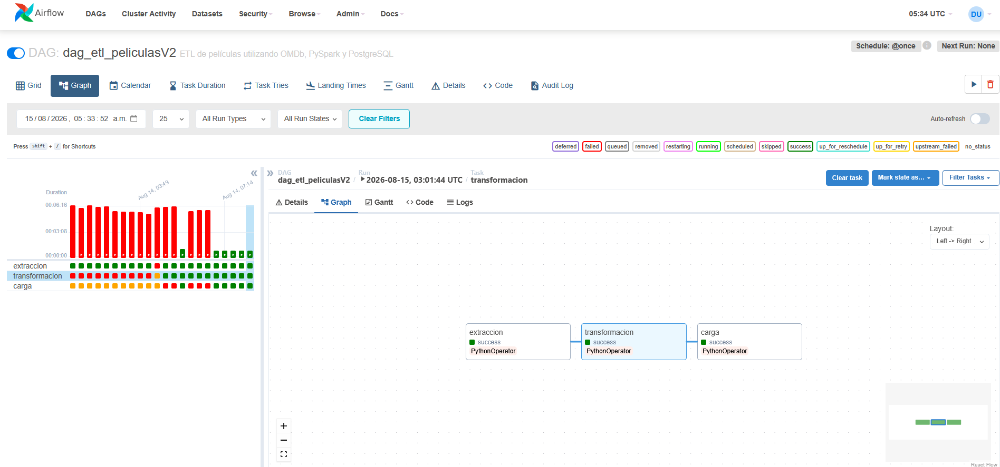
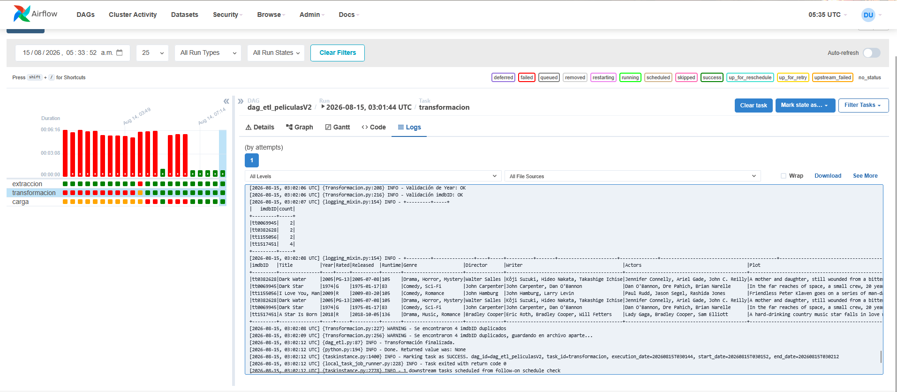

# ETL de peliculas (Version 2)
## Descripción

Proyecto de reconstrucción y mejora de un pipeline ETL para la extracción, transformación y 
almacenamiento de información de películas obtenida mediante la API de OMDb.

El proyecto implementa una arquitectura ETL por capas, separando los datos en etapas 
de extracción (Raw), transformación (Processed) y almacenamiento destino. 
El procesamiento de los datos se realiza mediante PySpark y el flujo es orquestado 
con Apache Airflow dentro de un entorno contenerizado con Docker 

A 14/08/2026 se encuentran implementadas las etapas de extracción y transformación, 
incluyendo validaciones de calidad de datos y detección de registros duplicados.

La arquitectura sigue principios de separación de responsabilidades y procesamiento 
por capas, permitiendo evolucionar posteriormente hacia una estrategia de carga 
incremental y una arquitectura de datos tipo Medallion.

## Tecnologías empleadas
* **Lenguaje:** Python
  * requests
  * logging
  * pandas
  * json
  * python-dotenv
* **Procesamiento:** PySpark
* **Orquestador:** Apache Airflow
* **Contenedores:** Docker / Docker Compose
* **Formato de almacenamiento:** Parquet
* **Base de datos:** PostgreSQL
* **Sistema operativo:** WSL2 (Ubuntu)

### Etapas del Pipeline
#### Extracción
La extracción se realiza mediante la API de OMDb.

El proceso obtiene información de películas y almacena los datos extraídos en 
formato Parquet para su posterior procesamiento.

La configuración de acceso a la API se gestiona mediante variables de entorno, 
evitando almacenar credenciales directamente en el código fuente.
### Transformación
La transformación se realiza utilizando PySpark.

En esta etapa se realizan diferentes procesos de exploración, limpieza, 
estandarización y validación de los datos.

Entre las principales transformaciones realizadas se encuentran:

* Exploración del esquema de los datos.
* Identificación y procesamiento de estructuras anidadas.
* Extracción de información contenida en el campo `Ratings`.
* Separación de las calificaciones de:
  * Internet Movie Database (IMDb)
  * Rotten Tomatoes
  * Metacritic
* Identificación de valores nulos.
* Identificación de valores `N/A`.
* Conversión de valores `N/A` a valores nulos.
* Estandarización de los datos.
* Conversión de tipos de datos.
* Conversión de fechas.
* Conversión de valores numéricos.
* Validación del campo `Year`.
* Validación del identificador `imdbID`.
* Identificación de registros duplicados.

El identificador `imdbID` se utiliza como referencia para identificar posibles 
registros duplicados dentro del conjunto de datos.

Los registros duplicados se separan del conjunto principal y se almacenan en una 
ruta independiente para su posterior revisión.

### Carga
Los datos transformados se almacenan en formato Parquet dentro del directorio 
de datos procesados y se cargan automáticamente en PostgreSQL en cada ejecución del DAG.

Actualmente la tabla peliculas se crea/actualiza en la base de datos Postgres 
definida en el contenedor Docker

Como mejora futura se implementará una estrategia de carga incremental que permita 
determinar cuándo un registro debe ser insertado o actualizado, evitando duplicados 
y sobreescrituras innecesarias

### Ejecución
El proyecto utiliza Docker Compose para levantar los diferentes servicios necesarios 
ara la ejecución del pipeline. Al ejecutar el DAG principal, los datos se extraen de 
la API, se transforman con Spark y se cargan en Postgres.

Los principales componentes son:

Airflow Webserver: interfaz para monitorear y ejecutar los DAGs.

Airflow Scheduler: encargado de programar y ejecutar las tareas.

PostgreSQL: base de datos utilizada por Airflow y como destino del ETL.

Spark Master: nodo maestro del procesamiento Spark.

Spark Worker: nodo encargado de ejecutar tareas de Spark.

Para iniciar los servicios: docker compose up -d

### Reflexión
Decisiones técnicas

Se decidió utilizar PySpark para la etapa de transformación con el objetivo de 
trabajar con un motor de procesamiento distribuido y practicar el manejo 
de datos semiestructurados.

El formato Parquet se utiliza como almacenamiento intermedio debido a su estructura 
columnar y su integración con Spark.

La información proveniente de la API contiene estructuras anidadas, por lo que se 
implementó un proceso específico para extraer y transformar el campo Ratings.

También se incorporaron validaciones de calidad de datos antes de generar el dataset
procesado, incluyendo:

valores nulos;
valores N/A;
tipos de datos;
validación de identificadores;
registros duplicados.

La configuración del proyecto se encuentra separada del código mediante variables de entorno 
y archivos de configuración, mientras que Docker permite reproducir el entorno de ejecución 
de los diferentes componentes.  

Mejoras(deuda técnica): 
Entre las siguientes mejoras contempladas para el proyecto se encuentran:

Implementar cargas incrementales.
Definir una estrategia de INSERT/UPDATE utilizando imdbID como clave de negocio.
Evaluar el almacenamiento de históricos de cambios.
Mejorar las validaciones de calidad de datos.
Incorporar pruebas automatizadas.
Mejorar el manejo de errores y reintentos.
Evaluar una arquitectura de almacenamiento más cercana a un escenario productivo.

### Anexos: 

Imagen del proceso realizado empleando Apache Airflow

Imagen de los logs dentro de Apache Airflow
